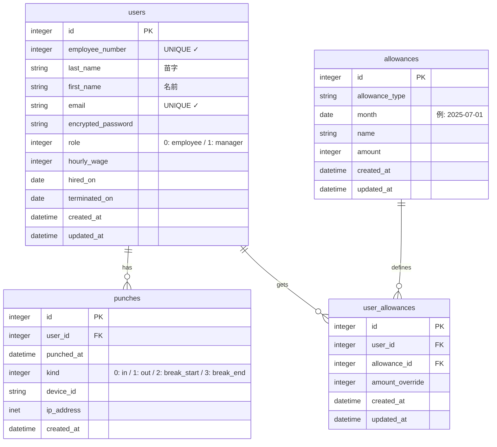

```mermaid
erDiagram
    users {
        integer  id PK
        integer  employee_number "UNIQUE ✓"
        string   last_name      "苗字"
        string   first_name     "名前"
        string   email           "UNIQUE ✓"
        string   encrypted_password
        integer  role  "0: employee / 1: manager"
        integer  hourly_wage
        date     hired_on
        date     terminated_on
        datetime created_at
        datetime updated_at
    }

    punches {
        integer  id PK
        integer  user_id FK
        datetime punched_at
        integer  kind  "0: in / 1: out / 2: break_start / 3: break_end"
        string   device_id
        inet     ip_address
        datetime created_at
    }

    allowances {
        integer id PK
        string  allowance_type
        date    month   "例: 2025-07-01"
        string  name
        integer amount
        datetime created_at
        datetime updated_at
    }

    user_allowances {
        integer id PK
        integer user_id FK
        integer allowance_id FK
        integer amount_override
        datetime created_at
        datetime updated_at
    }

    %%— 1:N —%%%%%%%%%%%%%%%%%%%%%%%%%%%%%%%%%%%%%%%%%%%%%%%%%%%%%%%%%
    users      ||--o{ punches         : has
    users      ||--o{ user_allowances : "gets"
    allowances ||--o{ user_allowances : "defines"
    
    %%— Optional aggregated cache —%%%%%%%%%%%%%%%%%%%%%%%%%%%%%%%%%%%
    %% attendance_monthlies  ||--|| users : aggregates
```
